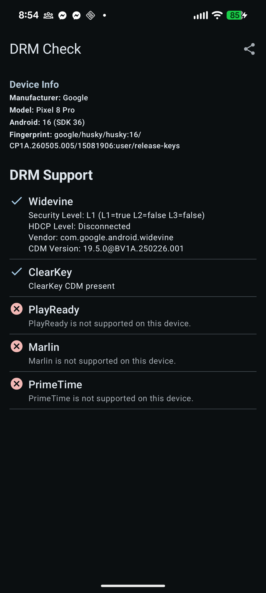

# CheckDrmInfo

An Android app that probes which DRM (Digital Rights Management) systems are present and active on a device, along with detailed capability information where available.

## What it checks

| DRM System | UUID | Used by |
|---|---|---|
| Widevine | `EDEF8BA9-79D6-4ACE-A3C8-27DCD51D21ED` | Google / most Android streaming |
| ClearKey | `E2719D58-A985-B3C9-781A-B030AF78D30E` | W3C open standard |
| PlayReady | `9A04F079-9840-4286-AB92-E65BE0885F95` | Microsoft |
| Marlin | `5E629AF5-38DA-4063-8977-97FFBD9902D4` | Sony / Amazon select devices |
| PrimeTime | `F239E769-EFA3-4850-9C16-A903C6932EFB` | Adobe broadcast streaming |

For Widevine, the app additionally reports:
- Security level (L1 / L2 / L3)
- HDCP output level
- CDM vendor string
- CDM version

## Screenshots

Pixel 8 Pro — Android 16 (SDK 36):



- Widevine L1, HDCP level reflects connected output (Disconnected when no HDMI)
- ClearKey present (standard on all Android devices)
- PlayReady, Marlin, PrimeTime not supported (expected on stock Google devices)

## Architecture

The project was refactored from a single 450-line `MainActivity` into a layered structure:

```
app/src/main/java/com/example/checkdrminfo/
├── MainActivity.kt              # 13 lines — just onCreate + theme
├── DRMChecker.kt                # MediaDrm probing; injectable factory for testability
├── DRMViewModel.kt              # viewModelScope + Dispatchers.IO; injectable dispatcher
├── model/
│   └── DrmInfo.kt               # DrmResult sealed class, DrmEntry, DrmInfoState, DeviceInfo
└── ui/
    ├── DrmComponents.kt         # Stateless composables + previews
    └── DrmInfoScreen.kt         # Adaptive layout + screen-level previews
```

### Adaptive layout

`currentWindowAdaptiveInfo()` drives the layout:
- **Compact width** (phone portrait) → single scrollable column
- **Medium / Expanded width** (tablet, foldable, landscape, TV) → two-pane: device info on the left, DRM list on the right

### State management

`DRMViewModel` exposes a single `StateFlow<DrmInfoState>`. All five DRM checks run concurrently via `async`/`await` on `Dispatchers.IO` and collapse into a single state update.

## Requirements

- **minSdk 30** (Android 11) — `MediaDrm.use {}` requires API 28+; Widevine property APIs are stable from 30
- **targetSdk 35**

## Tests

| Suite | Count | Notes |
|---|---|---|
| `DRMCheckerTest` | 17 | All 5 DRM systems × not-supported / exception / supported; Widevine detail parsing |
| `DRMViewModelTest` | 10 | `MainDispatcherRule` + `kotlinx-coroutines-test` |
| `DeviceInfoTest` | — | `DeviceInfo` default-value safety |
| `DrmUiTest` (instrumented) | 9 | Compose UI tests for all component states |

Run unit tests:
```
./gradlew test
```

Run instrumented tests (device or emulator required):
```
./gradlew connectedAndroidTest
```

## Build

```
./gradlew installDebug
```
